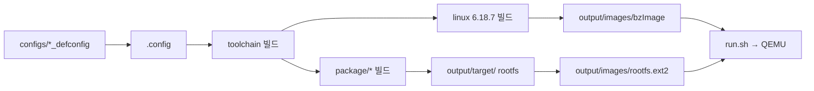

## 프로젝트 개요

이 저장소는 **Buildroot 2026.05-rc1** 기반이며, `qemu_x86_64_defconfig`를 기준으로 **QEMU x86_64 + virtio-gpu** 환경에서 Linux 그래픽스(DRM/KMS, modetest)를 공부하기 위해 커스터마이즈된 프로젝트입니다.

---

## 커널 버전

**Linux 6.18.7** 을 받아 빌드합니다.

| 항목 | 값 |
|------|-----|
| 버전 | `6.18.7` (커스텀 지정) |
| 소스 | `linux-6.18.7.tar.xz` (kernel.org mirror) |
| 커널 설정 | `board/qemu/x86_64/linux.config` |
| 출력 | `output/images/bzImage` |

`BR2_LINUX_KERNEL_LATEST_VERSION`이 아니라 **`BR2_LINUX_KERNEL_CUSTOM_VERSION`** 으로 6.18.7을 직접 고정해 두었습니다. defconfig에도 동일하게 명시되어 있습니다.

```9:13:configs/qemu_x86_64_defconfig
BR2_LINUX_KERNEL=y
BR2_LINUX_KERNEL_CUSTOM_VERSION=y
BR2_LINUX_KERNEL_CUSTOM_VERSION_VALUE="6.18.7"
BR2_LINUX_KERNEL_USE_CUSTOM_CONFIG=y
BR2_LINUX_KERNEL_CUSTOM_CONFIG_FILE="board/qemu/x86_64/linux.config"
```

이미 빌드된 흔적도 있습니다: `dl/linux-6.18.7.tar.xz`, `output/build/linux-6.18.7/`.

커널 설정에는 virtio-gpu 관련 옵션이 켜져 있습니다.

```31:34:board/qemu/x86_64/linux.config
CONFIG_DRM=y
CONFIG_DRM_QXL=y
CONFIG_DRM_BOCHS=y
CONFIG_DRM_VIRTIO_GPU=y
```

---

## 디렉토리 구조

```
buildroot/
├── arch/          # 타겟 아키텍처별 Kconfig (156K)
├── board/         # 보드별 커널/부트로더 설정, 패치, 스크립트 (9.1M)
│   └── qemu/x86_64/   ← 이 프로젝트의 핵심 커스텀 위치
│       ├── linux.config      # 커널 .config
│       └── post-build.sh     # rootfs 후처리 (tty1 getty 등)
├── boot/          # 부트로더 패키지 (U-Boot, GRUB 등)
├── configs/       # defconfig 모음 (~315개 보드 프리셋)
│   └── qemu_x86_64_defconfig  ← 현재 사용 중
├── dl/            # 다운로드 캐시 (소스 tarball, 1.3G)
├── docs/          # Buildroot 문서
├── fs/            # rootfs 이미지 포맷 (ext2, squashfs 등)
├── linux/         # 커널 패키지 빌드 레시피 (linux.mk)
├── output/        # 빌드 산출물 (14G) — git 제외 대상
│   ├── build/     # 각 패키지 빌드 트리
│   ├── host/      # 호스트 도구 (gcc, qemu 등)
│   ├── images/    # bzImage, rootfs.ext2
│   ├── staging/   # 크로스 컴파일 sysroot
│   └── target/    # 최종 rootfs 내용
├── package/       # 2900+ 패키지 레시피 (*.mk, Config.in)
├── support/       # 빌드 인프라, 스크립트, kconfig
├── system/        # skeleton, device table 등
├── toolchain/     # 툴체인 설정
├── utils/         # 유틸리티 스크립트
│
├── mydocs/        # 프로젝트 개인 노트 (modetest 등)
├── run.sh           # QEMU 실행 (virtio-gpu + SDL GL)
├── build.sh         # make libdrm-rebuild all
└── .config          # 현재 활성 빌드 설정
```

### Buildroot 빌드 흐름 (간략)



---

## 이 프로젝트의 커스텀 포인트

| 구분 | 내용 |
|------|------|
| **타겟** | x86_64, QEMU PC 머신 |
| **defconfig** | `qemu_x86_64_defconfig` |
| **주요 패키지** | `libdrm` (+ modetest 테스트 포함), `busybox`, `strace` |
| **rootfs** | ext2 (`rootfs.ext2`) |
| **실행** | `run.sh` — virtio-gpu-pci + SDL GL로 QEMU 부팅 |
| **패치** | `board/qemu/patches` (글로벌 패치 디렉토리) |

`run.sh`는 빌드된 `bzImage`와 `rootfs.ext2`를 QEMU로 올리고, virtio-gpu 위에서 `modetest`로 DRM/KMS 테스트를 하는 구성입니다.

---

## 참고

- Buildroot 기본값의 "Latest version"을 쓰면 **매 릴리스마다 다른 커널**이 잡힙니다. 이 프로젝트는 **6.18.7로 고정**되어 재현성이 있습니다.
- `output/`(14G)와 `dl/`(1.3G)는 빌드/다운로드 캐시라 용량이 큽니다.
- `mydocs/testmode_note.txt`에 modetest connector/CRTC ID 설명이 정리되어 있습니다.

더 깊게 보고 싶은 부분(패키지 추가 내역, toolchain 버전, virtio-gpu 빌드 경로 등)이 있으면 말해 주세요.
