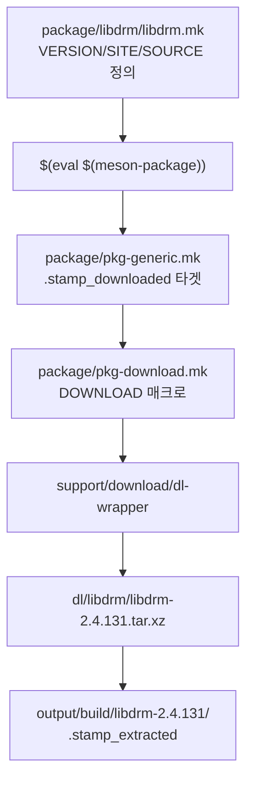

핵심 파일은 여기입니다.
- modetest 본체: output/build/libdrm-2.4.131/tests/modetest/modetest.c
- 공용 DRM 열기/헬퍼: output/build/libdrm-2.4.131/tests/util/kms.c
- Buildroot의 libdrm 패키지 설정: package/libdrm/libdrm.mk
- libdrm 패키지

package/libdrm/libdrm.mk 정의에 따라 dl/에 캐시한 뒤 output/에 압축 해제.

## 1. 패키지 정의 (버전/URL)

핵심은 `package/libdrm/libdrm.mk`입니다.

```7:12:package/libdrm/libdrm.mk
LIBDRM_VERSION = 2.4.131
LIBDRM_SOURCE = libdrm-$(LIBDRM_VERSION).tar.xz
LIBDRM_SITE = https://dri.freedesktop.org/libdrm
LIBDRM_LICENSE = MIT
LIBDRM_LICENSE_FILES = data/meson.build
LIBDRM_INSTALL_STAGING = YES
```

| 항목 | 값 |
|------|-----|
| 버전 | **2.4.131** |
| 방식 | **HTTPS tarball** (`SITE_METHOD` = `https`, git 아님) |
| URL | `https://dri.freedesktop.org/libdrm/libdrm-2.4.131.tar.xz` |
| 백업 미러 | `https://sources.buildroot.net/libdrm` |
| 해시 검증 | `package/libdrm/libdrm.hash` |

마지막 줄의 `$(eval $(meson-package))`가 이 레시피를 Buildroot 패키지 인프라에 등록합니다.

---

## 2. 다운로드 코드 경로

직접 wget/git 하는 스크립트는 없고, **공통 패키지 인프라**가 처리합니다.



**다운로드 트리거** (`pkg-generic.mk`):

```174:196:package/pkg-generic.mk
$(BUILD_DIR)/%/.stamp_downloaded:
	@$(call step_start,download)
	...
	$(if $($(PKG)_MAIN_DOWNLOAD), \
		$(call DOWNLOAD, \
			$($(PKG)_MAIN_DOWNLOAD), \
			...
		) \
	)
	...
	$(Q)touch $@
```

**실제 다운로드 매크로** (`pkg-download.mk`):

```104:137:package/pkg-download.mk
define DOWNLOAD
	$(Q)$(DOWNLOAD_SET_UMASK) mkdir -p $($(PKG)_DL_DIR)
	...
		flock $($(PKG)_DL_DIR)/.lock $(DL_WRAPPER) \
		...
		-o '$($(PKG)_DL_DIR)/$(notdir $(1))' \
		...
		$(foreach uri,$(call DOWNLOAD_URIS,$(1),$(PKG)),-u $(uri)) \
		...
endef
```

`make libdrm-show-info` 결과도 동일합니다:

```json
"version": "2.4.131",
"downloads": [{
  "source": "libdrm-2.4.131.tar.xz",
  "uris": [
    "https+https://dri.freedesktop.org/libdrm",
    "https|urlencode+https://sources.buildroot.net/libdrm",
    ...
  ]
}]
```

---

## 3. 실제 파일 위치

| 단계 | 경로 |
|------|------|
| 다운로드 캐시 | `dl/libdrm/libdrm-2.4.131.tar.xz` |
| 압축 해제/빌드 | `output/build/libdrm-2.4.131/` |
| 설치 (target) | `output/target/usr/bin/modetest` 등 |
| staging | `output/staging/usr/include/drm/` 등 |

빌드 순서: `libdrm-source` → `libdrm-extract` → `libdrm-patch` → `libdrm-configure` → `libdrm-build` → `libdrm-install`

---

## 4. 현재 `.config` 옵션

```
BR2_PACKAGE_LIBDRM=y
BR2_PACKAGE_LIBDRM_HAS_ATOMIC=y
BR2_PACKAGE_LIBDRM_INSTALL_TESTS=y   # modetest 포함
```

GPU별 백엔드(intel, radeon 등)는 꺼져 있고, virtio-gpu용 기본 DRM API + modetest만 쓰는 구성입니다.

---

## 5. Git 관련 흔적 (표준 빌드와 다름)

`dl/libdrm/`에 아래가 같이 있습니다:

- `libdrm-2.4.131.tar.xz` — **표준 Buildroot가 쓰는 파일**
- `git/` — `https://github.com/js-mun/libdrm.git` 클론 캐시
- `libdrm-main-git4.tar.gz` — git 백엔드 포맷 (`BR_FMT_VERSION_git = -git4`)

그리고 `output/build/libdrm-2.4.131/` 안에도 `.git`이 있고, `js-mun/libdrm` fork 커밋(`Add comments for modetest`)이 있습니다.

이건 **공식 `libdrm.mk` 레시피와는 별개**로, 아래 중 하나로 보입니다:

- `LIBDRM_OVERRIDE_SRCDIR`로 로컬 git 트리를 rsync
- 빌드 디렉토리에 직접 git clone/수정

표준 Buildroot 경로만 쓰면 tarball → extract이므로 `.git`은 생기지 않습니다.

---

## Git으로 받으려면?

현재 레시피는 git이 아닙니다. 바꾸려면 `libdrm.mk`를 예를 들어 이렇게 수정해야 합니다:

```makefile
LIBDRM_VERSION = main          # 또는 커밋 해시
LIBDRM_SITE = https://gitlab.freedesktop.org/mesa/libdrm.git
LIBDRM_SITE_METHOD = git
# LIBDRM_SOURCE 는 git 방식에서 자동 생성 (libdrm-main-git4.tar.gz 형태)
```

또는 개발 중이면 `local.mk`에:

```makefile
LIBDRM_OVERRIDE_SRCDIR = /path/to/your/libdrm
```

---

정리하면, **코드는 `package/libdrm/libdrm.mk` + `pkg-generic.mk` + `pkg-download.mk` + `support/download/dl-wrapper`**, **버전은 2.4.131**, **방식은 Git이 아닌 HTTPS tarball**입니다. `output/build/libdrm-2.4.131/`의 git 흔적은 별도 커스텀 작업으로 보입니다.


## `LIBDRM_OVERRIDE_SRCDIR`란?

Buildroot가 보통 하는 일:

```
tarball 다운로드 → dl/ 에 캐시 → output/build/libdrm-2.4.131/ 에 압축 해제 → 패치 → 빌드
```

`LIBDRM_OVERRIDE_SRCDIR`를 쓰면 **다운로드/압축 해제/패치를 건너뛰고**, Buildroot 밖에 있는 소스 디렉토리를 **rsync로 복사**해서 빌드합니다.

```
외부 소스 (/home/mj/work/libdrm)
    │ rsync (변경된 파일만)
    ▼
output/build/libdrm-custom/   ← 빌드는 여기서
    │ meson build/install
    ▼
output/target/usr/bin/modetest
```

외부 소스는 `make clean` / `make libdrm-dirclean` 해도 **지워지지 않습니다**.

---

## 설정 방법

### 1. Buildroot 밖에 소스 받기

```bash
mkdir -p /home/mj/work/study_linux_graphics
cd /home/mj/work/study_linux_graphics

# 공식 upstream
git clone https://gitlab.freedesktop.org/mesa/libdrm.git
cd libdrm
git checkout libdrm-2.4.131   # Buildroot와 같은 버전 맞추기 (권장)
```

원하는 fork를 쓸 수도 있습니다:

```bash
git clone https://github.com/js-mun/libdrm.git /home/mj/work/study_linux_graphics/libdrm
```

### 2. `local.mk` 작성

Buildroot 루트(`.config`와 같은 위치)에 `local.mk`를 만듭니다.

```makefile
# /home/mj/work/study_linux_graphics/buildroot/local.mk

LIBDRM_OVERRIDE_SRCDIR = /home/mj/work/study_linux_graphics/libdrm
```

기본 경로는 `BR2_PACKAGE_OVERRIDE_FILE` = `$(CONFIG_DIR)/local.mk` 입니다.
다른 위치를 쓰려면 `make menuconfig` → **Build options** → **location of a package override file** 에서 변경합니다.

`local.mk`는 git에 넣지 않는 경우가 많습니다 (개인 경로이므로).

### 3. 기존 tarball 빌드 정리 후 빌드

이미 `output/build/libdrm-2.4.131/` 이 있으면 override와 공존합니다. 한 번 정리하는 것이 좋습니다.

```bash
cd /home/mj/work/study_linux_graphics/buildroot

make libdrm-dirclean          # 기존 libdrm 빌드 디렉토리 삭제
make libdrm-rebuild all       # override 소스로 rsync → 빌드 → rootfs 갱신
```

첫 빌드는 `make -j$(nproc)` 도 됩니다.

---

## 동작이 바뀌는 부분

| 항목 | 일반 빌드 | `OVERRIDE_SRCDIR` 사용 시 |
|------|-----------|---------------------------|
| 다운로드 | `dl/libdrm/libdrm-2.4.131.tar.xz` | **안 함** |
| 빌드 디렉토리 | `output/build/libdrm-2.4.131/` | **`output/build/libdrm-custom/`** |
| 버전 표시 | `2.4.131` | `custom` |
| Buildroot 패치 | `package/libdrm/*.patch` 적용 | **적용 안 함** |
| 소스 수정 위치 | `output/build/...` (지워짐) | **외부 디렉토리** (유지) |

빌드 디렉토리 이름이 `-custom`으로 바뀌는 이유는, override 시 `VERSION = custom`으로 설정되기 때문입니다.

```564:566:package/pkg-generic.mk
ifneq ($$($(2)_OVERRIDE_SRCDIR),)
$(2)_VERSION = custom
endif
```

rsync는 여기서 실행됩니다:

```222:228:package/pkg-generic.mk
$(BUILD_DIR)/%/.stamp_rsynced:
	...
	rsync -au --chmod=u=rwX,go=rX ... $(SRCDIR)/ $(@D)
```

---

## 개발 워크플로우

```bash
# 1. 외부 소스 수정
vim /home/mj/work/study_linux_graphics/libdrm/tests/modetest/modetest.c

# 2. libdrm만 다시 빌드 + rootfs 이미지 갱신
cd /home/mj/work/study_linux_graphics/buildroot
make libdrm-rebuild all

# 3. QEMU 테스트
./run.sh -t
```

`libdrm-rebuild`는:

1. `.stamp_built` 등 삭제
2. 외부 소스 → `output/build/libdrm-custom/` rsync (변경 파일만)
3. configure → build → install 재실행

configure 옵션(meson)을 바꿨다면:

```bash
make libdrm-reconfigure all
```

---

## 주의사항

### Buildroot 패치가 안 붙음

`package/libdrm/0001-tests-meson.build-disable-nouveau-tests-for-static-b.patch` 같은 패치는 override 시 **자동 적용되지 않습니다**. 필요하면:

- 외부 소스에 직접 커밋하거나
- `git am` / `patch`로 수동 적용

### `.git`은 rsync에서 제외됨

기본적으로 `.git`, `.svn` 등은 복사하지 않습니다:

```635:637:Makefile
RSYNC_VCS_EXCLUSIONS = \
	--exclude .svn --exclude .git --exclude .hg ...
```

버전 정보에 git 커밋이 필요하면:

```makefile
LIBDRM_OVERRIDE_SRCDIR_RSYNC_EXCLUSIONS = --include .git
```

### rsync 속도 최적화

libdrm는 작아서 보통 문제 없지만, 큰 트리라면:

```makefile
LIBDRM_OVERRIDE_SRCDIR_RSYNC_EXCLUSIONS = \
	--exclude .cache \
	--exclude build
```

### override 해제

`local.mk`에서 해당 줄을 지우거나 주석 처리한 뒤:

```bash
make libdrm-dirclean
make libdrm-rebuild all
```

다시 tarball(`2.4.131`) 방식으로 돌아갑니다.

---

## 확인 명령

```bash
# override가 인식되는지
make libdrm-external-deps
# → file:///home/mj/work/study_linux_graphics/libdrm

# 빌드 디렉토리 확인
ls output/build/libdrm-custom/

# modetest 경로
ls output/target/usr/bin/modetest
```

---

## 이 프로젝트에 맞는 예시

현재 `output/build/libdrm-2.4.131/`에 `js-mun/libdrm` fork 흔적이 있는데, override를 쓰면 구조가 더 명확해집니다.

```makefile
# buildroot/local.mk
LIBDRM_OVERRIDE_SRCDIR = /home/mj/work/study_linux_graphics/libdrm
```

```bash
git clone https://github.com/js-mun/libdrm.git /home/mj/work/study_linux_graphics/libdrm
cd buildroot
make libdrm-dirclean
make libdrm-rebuild all
```

이후 modetest 수정은 `/home/mj/work/study_linux_graphics/libdrm/` 에서 하고, `make libdrm-rebuild all`만 반복하면 됩니다.

`local.mk` 예시 파일을 프로젝트에 만들어 둘까요? (git에는 넣지 않고 `.gitignore`에 추가하는 방식으로)
